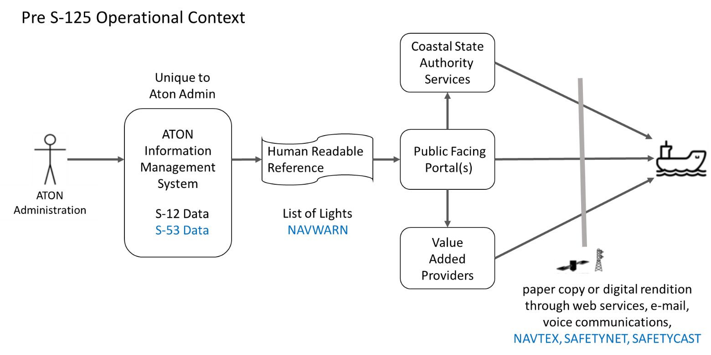

\pagebreak

# Operational Context {#sec:operational_context}

This section describes the context of the service from an operational perspective.

## Pre S-201 Operational Context {#sec:pres_125_operational_context}

From a practical perspective, the List of Lights is intended for use by mariners as a compendium to the navigational chart for AtoN information. In accordance with IHO S-12, the "List of Lights and Fog Signals" describes maritime signal installations on land or afloat, producing light or sound signals (fog signals). In addition, these volumes contain information relating to certain other navigational aids: buoyage (day and night), signals (port signals, rescue signals, tide signals, etc.), radio-based aids (radio beacons, radar, radio navigation systems), etc. 

IHO S-53, is concerned with drafting navigational warnings or with the issuance of meteorological forecasts and warnings under the Global Maritime Distress and Safety System (GMDSS). Navigational Warnings (NW) are issued under the auspices of the IMO/IHO World-Wide Navigational Warning Service (WWNWS), in accordance with the requirements of IMO resolution A.706(17), as amended. NW, including AtoN casualties or changes which may impact navigational safety, are part of the Maritime Safety Information (MSI) system. MSI is promulgated in accordance with the requirements of IMO resolution A.705(17), as amended. It includes casualties to lights, fog signals, buoys and other aids to navigation affecting main shipping lanes as well as establishment of major new aids to navigation or significant changes to existing ones, when such establishment or change might be misleading to shipping. Currently, NW are promulgated as a radio broadcast and then printed in text format. The messages are standardized as SafetyNET, SafetyCast, NAVTEX broadcasts, and are in some countries accessible on the World Wide Web (WWW) or as voice broadcasts via coastal radio stations. System interfaces between NW publishers, NAVAREA (or Sub-Area) coordinator and broadcast service are not standardized, and may rely on manual processes involving e-mail, telephone, voice radio transmissions, fax, telex and manual re-entering of information from one system to another, or much more advanced solutions. Provision of NW via web is not standardized. NAVTEX, SafetyCast and SafetyNET cannot transport structured data formats for a joint NW-NM solution.   

The pre-S-201 “present day” operational context of promulgation at the component level, is depicted below. A generalize assumption is made that information management systems are unique to each AtoN Administration.

{#fig:present_day_operational_context}

System interfaces between AtoN Administrations, Hydrographic Officers, Nautical Publication Publishers, and dissemination methods are unique, and may rely on manual processes involving carriage of paper print copies or human readable digital renditions obtained via web services or email. Provision of the AtoN information included within the List of Lights via web services is not standardized. 

## Envisioned Operational Context {#sec:envisioned_operational_context}

A standardized structured AtoN information format would enable compatible systems to exchange AtoN information seamlessly. Each AtoN Administration may have a unique AtoN Information Management System. This system however, should be able to automatically promulgate AtoN data from the authoritative source, for use by national and local authorities (e.g.  Coastal State Authorities, Harbor and Port Authorities), the mariner public, as well as being available for use by commercial value-added service providers. 

AtoN Administrations will administer and publish local AtoN data, for their area of responsibility. Typically this includes areas within that state’s exclusive economic zone. Where appropriate they should coordinate with adjacent or overlapping AtoN Administrations who share responsibility within the same waterway.  (e.g. Both the U.S. Coast Guard and Canadian Coast Guard maintain aids to navigation within the waterways comprising the Great Lakes.) The service instance descriptions will provide detailed information of coverage area available to users.

![Example of the AtoN information flow, as per [@cite:iala-ms2].](../../resources/AtoNInfoDistribution.png){#fig:ms_aton_information_flow}

The service described in this specification defines the exchange of AtoN information using S-201 between a service provider and the end-user of such a service. In the most common case, the end-user will use an ECDIS to receive and display the information onboard a ship. However, according to the IALA interpretation of the IMO *MS-2 Aids to Navigation* maritime service [@cite:iala-ms2], as illustrated in [@fig:ms_aton_information_flow], the application of this service specification is not limited to the provision of information from shore to ship. It may also be used to harmonise the exchange of AtoN information between other stakeholders in the data distribution chain before it is received by the end-user on a ship. This includes the data exchange between AtoN Authorities, coastal authorities, Regional Electronic Navigational Chart Coordination Centre (RENCs), Value-Added Providers, public portals, and other entities. AtoN Authorities are expected to exchange AtoN information with other authorities primarily through S-201. A different service specification will describe that operation. However, the use of other S-100 data product specifications, such as S-201 (covered by this service specification), S-101 and S-124, can be considered for the remaining AtoN information distribution operations.

Depending on the specific requirements, the service usage patterns may differ. For example, a Value-Added Provider could pull all available data and subscribe to updates from a data producer (e.g. national AtoN authority) and redistribute the data to the end-user via its own implementation of this service (after applying validation checks or optimising the data for a specific group of end-users). The orchestration of multiple AtoN information services in the distribution chain, however, is not in the scope of this document and lies within the responsibility of the service provider(s).

It is finally noted that in the future, the legacy List of Lights publications could be supplemented or even replaced, pending of course an IMO SOLAS amendment endorsement, by more up to date electronic AtoN information found in S-101 and S-125.

### Relationships between S-125 and S-101, S-124, S-201 {#sec:relationship_124_s125_s201}

IHO has produced guidance on the interoperability between S-125 and the S-101, S-124, S-201 data product specifications [@cite:iho-s125-interoperability-guide]. This document provides guidance on how S-125 will work on ECDIS devices and mentions the change of scope for editions 1.0.0 and 2.0.0 of the data product. This change limits the scope of S-125 to an overlay displaying only information on any AtoN status changes, which differ from the design state that appears in S-101. For more information please refer the IHO document.

### Discoverability and Dissemination {#sec:discoverability_and_dissemination}

The S-201 data should be discoverable only by Hydrographic Offices, Coastal State Authorities and other relevant organisations. S-201 data should enhance S-124 NW and ENC S-101 services, especially by reducing the effort in the transformation of data, with the harmonization of data models. This could be accomplished by introducing efficient data exchange mechanism between authorities.

## Functional and Non-functional Requirements {#sec:functional_non_functional_reqs}

The table below defines the functional requirements, as there are defined in the IALA documentation for the IMO MS-2 Aids to Navigation Maritime Service [@cite:iala-ms2]. Please note that the feature identifiers referenced in [@tbl:ms2-functional-requirements], are also referring to service features identified in the IALA MS-2 specification document.

| Requirement Type | Requirement ID | Requirement Name | Requirement Text | Feature Identifier |
| --- | --- | --- | --- | --- |
| **Functional** | MS2-FR001 | Provision of dataset(s) | The service provides S-100 compliant dataset(s) with all current and valid AtoN Information assigned to that dataset(s). | F001, F005 |
| **Functional** | MS2-FR002 | Request for dataset(s) | The end users can receive on demand S-100 compliant dataset(s).  Service providers will respond with current data relevant to the request but will not subdivide datasets to less than that defined by the authoritative source of the data. | F001, F005 |
| **Functional** | MS2-FR003 | Filter AtoN Information | The end-users can filter the AtoN information based on a point, line, polygon geometry, AtoN type, AtoN status etc. | F001, F008 |
| **Functional** | MS2-FR004 | Retrieve AtoN Status Updates | The end-users are able to request and filter out only the AtoN which have associated status changes. | F001, F008 |
| **Functional** | MS2-FR005 | Subscribe to dataset(s) | The end users can subscribe to receive S-100 compliant dataset(s) and their respective updates. Subscription requests should be able to include the start and stop time of the subscription. | F002, F004, F005 |
| **Functional** | MS2-FR006 | Status of Subscription | The service provides a subscription status notification. This could indicate termination of subscription from the service provider side. | F002, F003 |
| **Functional** | MS2-FR007 | Data Update Status | The service must be able to provide the users with the status of their respective subscriptions and whether the current dataset is the latest one, along with other relevant information. | F002, F006 |
| **Functional** | MS2-FR008 | Cancellation of Subscription | The service provides a facility to cancel the subscription. | F004 |
| **Functional** | MS2-FR009 | Data Validation Certificate | The service can provide on demand the security certificate that was used to secure the data transmission. | F006, F009 |
| **Functional** | MS2-FR012 | Information Filtering | The end users can filter the relevant AtoN information by name or based on a point, line, polygon geometry, or receive the complete service content.  | F008 |
| **Functional** | MS2-FR013 | Delivery Acknowledgement Request | The service is able to request a data delivery acknowledgement for any end-user. The requested acknowledgement should support multiple levels (receiving, reading etc.) | F011 |
| **Functional** | MS2-FR014 | Delivery Acknowledgement Confirmation | The service provides a common but secure facility for all end-users to acknowledge the successful updates of AtoN information if requested. | F011 |
| **Functional** | MS2-FR015 | Subscription Updates | The service is able to identify and contact the subscribed end-users to push updates on the requested dataset(s). | F012 |
| **Functional** | MS2-FR016 | Input Automation | The service updates the advertised datasets, based on the AtoN status updates received. | F013 |
| **Functional** | MS2-FR017 | End-User Precision Tailoring | The service is able to supply AtoN information with certain details (e.g. precision of decimal points) tailored to the corresponding end-user. | F010, F018 |
| **Functional** | MS2-FR018 | Change Log | The service allows data producers to track the record of changes to the advertised dataset(s) for any time interval required. | F015 |
| **Functional** | MS2-FR019 | Change Log State | The service allows data producers to view the full state of the AtoN Information as provided to consumers at any past point in time. | F015 |

: Functional Requirements for the MS-2 – Aids to Navigation  Service. {#tbl:ms2-functional-requirements}

The table below defines non-functional requirements for the S-201 service, as these are defined in the IALA documentation for the IMO MS-2 Aids to Navigation Maritime Service [@cite:iala-ms2]. Please note that the feature identifiers referenced in [@tbl:ms2-non-functional-requirements], are also referring to service features identified in the IALA MS-2 specification document.

| Requirement Type | Requirement ID | Requirement Name | Requirement Text | Feature Identifier |
| --- | --- | --- | --- | --- |
| **Non-functional** | MS2-NFR001 | Authorization | Service consumers are authorized by the provider for reception of data by the service. This may be public authorization (everyone has access), or limited authorization associated with a transactional service | F010, F016, F017 |
| **Non-functional** | MS2-NFR002 | Authenticity | Service consumers can verify independently the authenticity of the AtoN information transmitted to them. | F006, F009 |
| **Non-functional** | MS2-NFR003 | Integrity | It is clear to both service provider and consumer whether changes have been made to the AtoN information after this was created. | F006, F009 |
| **Non-functional** | MS2-NFR004 | Availability | The service is consistently available in its ability to deliver AtoN Information to its consumers. (i.e. Service should have a high availability) | F001, F002, F004, F005, F011, F013 |
| **Non-functional** | MS2-NFR005 | Responsiveness | The service provides a response to a service consumer’s request without delay, and the data provided should be (near) real time. | F001, F002, F011, F016 |
| **Non-functional** | MS2-NFR006 | Performance | The service can handle multiple requests simultaneously (e.g. 1000/sec). | F001, F010, F012 |
| **Non-functional** | MS2-NFR007 | Portability | The service makes the data available in portable machine-readable formats (e.g. XML/JSON) | F014 |
| **Non-functional** | MS2-NFR008 | Compression | The service is able transmit the data in compressed format, with the compression method (e.g., gzip) clearly indicated. | F001, F005, F008 |
| **Non-functional** | MS2-NFR009 | Accessibility | The AtoN information is accessible as much as possible and modern APIs should be supported for machine-to-machine communication. | F005, F010, F013, F014 |
| **Non-functional** | MS2-NFR010 | Compatibility | The service is compatible with as many end-user devices as possible and conforms to the latest relevant maritime standards (e.g. IEC 63173-2 (SECOM), S-100 (S-124, S-125, S-201, S-240)) | F005, F010, F013, F014 |

: Non-Functional Requirements for the MS-2 – Aids to Navigation Service. {#tbl:ms2-non-functional-requirements}

## Other Constraints {#sec:other_constraints}

### Relevant Industrial Standards {#sec:relevant_industrial_standards}

Not Applicable

### Operational Nodes {#sec:operational_nodes}

The following tables describe the operational nodes of the service.

| Operational Node | Remarks |
| --- | --- |
| ***AtoN Administration – AtoN Information Management System*** | The AtoN Information Management System collects all AtoN Information available from its Authoritative Source (AtoN Administration). |
| ***Coastal State Authority*** | Governmental Agency responsible for overseeing vessel arrival within a respective area. Should facilitate dissemination of S-201. | 
| ***Discoverable Service*** | S-201 services must be discoverable and may be operated by public or private entities. |
| ***Service Consumer*** | Consumers of S-201 service. This includes only state authorities and relevant organisations such as Hydrographic Offices and Coastal State Authorities. |

: Operational Nodes providing the S-201 service. {#tbl:operational_nodes}

### Operational Activities {#sec:operational_activities}

The following tables describe the operational activities of the service.

| Operational Activity | Remarks |
| --- | --- |
| ***Identify S-201 Dataset(s)*** | The service consumer is able to identify the availability of S-201 dataset(s) for a given area.  This includes identification of the authoritative source for the dataset(s). |
| ***Get S-201 Dataset(s)*** | The service consumer is able to retrieve S-201 dataset(s) from the service provider.  This includes retrieving archived dataset(s). |
| ***Subscribe*** | The service consumer is able to subscribe to receive S-201 dataset(s) from the service provider for a given timeframe and area. |
| ***Version Designation*** | The service provider needs to track the current version of S-201 dataset(s) and make this discoverable to service consumers. |
| ***Record of Changes*** | The service provider needs to log changes between versions of S-201 dataset(s). |
| ***Dissemination of Changes*** | The “delta” compilation of changes made to a dataset(s) since the last version was issued may be made available to service consumer before the release of a new dataset version. |

: Operational Activities supported by the S-201 service. {#tbl:operational_activities}

### Use Cases {#sec:use-cases}

#### Use-case #1

**Name**: Retrieve AtoN status indication information for portrayal on a Hydrographic Office

**Description**: Retrieve and portray changes on the design state of AtoN for charting.

**Actors**: AtoN information service, Hydrographic Office

**Frequency of Use**: Ad-hoc, typically triggered upon an update request by the Hydrographic Office

**Pre-conditions**: The service instance is known to the relevant system or has access to a service registry in which the service instance can be discovered. Data is packaged in S-201 datasets with MRN attributes populated. S-201 datasets cannot be broken apart into division beyond those established by the authoritative source for liability reasons.

**Ordinary Sequence**:

  1. The AtoN status indication information is requested from the service.
  2. The service directly answers the request with the appropriate data. These include the S-201 AtoN status indication features of the data product, but  not necessarily the design state AtoN information.
  3. The data is rendered and displayed to the user.

**Post-conditions**: The correct AtoN status indication information is displayed.

