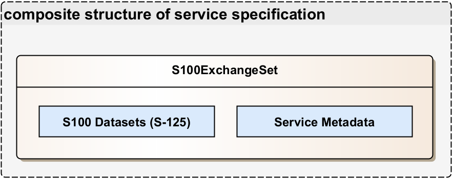

\pagebreak

# Service Data Model {#sec:service_data_model}

This section describes the logical data structures to be exchanged between providers and consumers of the service. The service data model is bound by the current definition of the IALA S-201. For complete and updated documentation refer to the latest S-201 Product Specification which can be found at:
    
    https://www.iala.int/technical/data-modelling/iala-s-200-development-status/s-201/

Included in the service data model is a full description followed by specific extracts for;

* AtoN Information Features and Information types
* Enumerations
* Complex Attributes

Note that the S-100 specification [@cite:iho-s100] describes in Appendix 9-B how S-100 based data models shall be formulated in XML schema format.

Since the main purpose of the discussed service is to provide enhanced AtoN information for AtoN authorities, the S-201 information should be packaged as S-100 datasets, alongside any necessary metadata and other support information. The S-100 data model specification [@cite:iho-s100] in Appendix 4aS-100 Part 17, introduces the Exchange Set data structure, precisely for supporting this functionality. To indicate that S-201 datasets are coupled with additional service metadata, we refer to the type S100ExchangeSet (see [@fig:s125_with_metadata]).

{#fig:s125_with_metadata width=65%}

# Service Internal Data Model

As the S-201 data model, used to represent the transmitted data, is developed independently from this service specification, the internal data model of the service should be adequate to generate the required S-201 datasets. In addition, a way to store service metadata that are not directly related to the data model (internal service identifies, signatures, etc.) is required. For further information, refer to IALA Guideline 1157 [@cite:iala-g1157]. However, these metadata are mostly implementation specific and therefore are not discussed in this service specification. Examples on how to implement this functionality can also be found in the IHO S-100 data model specification [@cite:iho-s100], as well as the SECOM standard [@cite:iec-63173-2].

